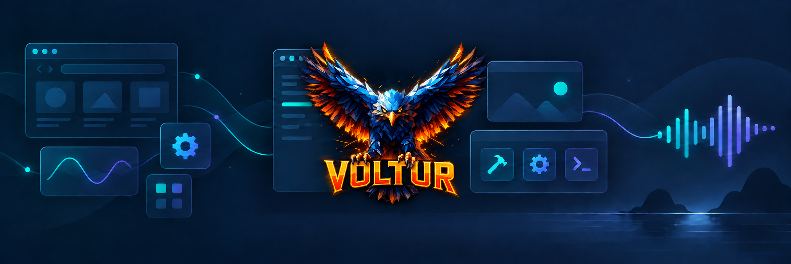

Создаю игры и полезные инструменты для **Astra** и Windows.

> Игры для Astra, плагины и отдельные приложения — собраны по категориям ниже.

## Игры для Astra

| Игра | Что внутри | Расход ИИ | В каталоге Astra | Последний релиз / загрузки |
| --- | --- | --- | --- | --- |
| [Детективная игра](https://github.com/Voltur792/detective-game) | Расследуйте дела, осматривайте места и проверяйте версии — в Astra или Telegram. | Высокий | Нет |   |
| [Морской бой](https://github.com/Voltur792/astra-sea-battle) | Два режима: быстрая партия или игра против Astra на интерактивной карте. | Низкий–средний | Нет |   |

## Плагины для Astra

| Проект | Что делает | Расход ИИ | В каталоге Astra | Последний релиз / загрузки |
| --- | --- | --- | --- | --- |
| [Mirror-upload](https://github.com/Voltur792/Mirror-upload) | Устанавливает среды исполнения, библиотеки плагинов и локальные модели Astra через зеркало Яндекс Диска. | Нет | Нет |   |
| [Voice communication-Discord](https://github.com/Voltur792/VC-Discord) | Голосовое общение с Astra в Discord, обсуждение экрана и музыка из Яндекс Музыки / VK. | Средний, зависит от длительности разговора; музыка — без ИИ | Нет |   |
| [Astra Music](https://github.com/Voltur792/astra-music) | Ищет и воспроизводит музыку из Яндекс Музыки и VK во встроенном плеере Astra. | Низкий; управление плеером — без ИИ | Нет |   |
| [Auto Assistant](https://github.com/Voltur792/auto-assistant) | Разбирает почту и помогает превращать важное в задачи и события. | Высокий | Нет |   |
| [Astra Browser Control](https://github.com/Voltur792/browser-control) | Управляйте вкладками и элементами браузера голосом. | Средний, зависит от задач | Нет |   |
| [Sleep Pause Timer](https://github.com/Voltur792/SPT) | Таймер, будильник и отслеживание бездействия. | Нет | ✅ Да |   |
| [Voice Text Input](https://github.com/Voltur792/voice-text-input) | Голосовой ввод текста в активное окно. | Низкий, зависит от распознавания речи | ✅ Да |   |
| [Яндекс Умный дом](https://github.com/Voltur792/Y-home-f-astra) | Управляйте устройствами умного дома через Astra. | Низкий, зависит от диалога | ✅ Да |   |

## Приложения для Windows

| Приложение | Что делает | Расход ИИ | В каталоге Astra | Последний релиз / загрузки |
| --- | --- | --- | --- | --- |
| [VoiceTyper](https://github.com/Voltur792/VoiceTyper) | Печатает продиктованный текст в любом активном окне. | Нет | — |   |
| [Таймер паузы](https://github.com/Voltur792/sleep-pause-timer) | Управляет воспроизведением, таймером и питанием компьютера. | Нет | — |   |
| [Supertonic Voice Builder](https://github.com/Voltur792/supertonic-voice-builder) | Подбирает голос по WAV и создаёт JSON для Supertonic 3 и Astra. | Нет облачных токенов; обработка локально | — |   |

Расход ИИ — примерная оценка: фактическое число токенов зависит от модели, длины запроса и количества действий. Счётчики показывают суммарные загрузки установочных файлов из GitHub Releases (пакеты .astraplugin и ZIP приложений); скачивания ZIP репозитория и Git-клоны в них не входят.

Каталог Astra: «Да» означает наличие проекта в [опубликованном индексе](https://mihailinl.github.io/astra-registry/registry/v1/index.json); «Нет» — отсутствие в индексе, «—» — не плагин Astra.

---

[Поддержать разработку на Boosty](https://boosty.to/voltur/donate)
